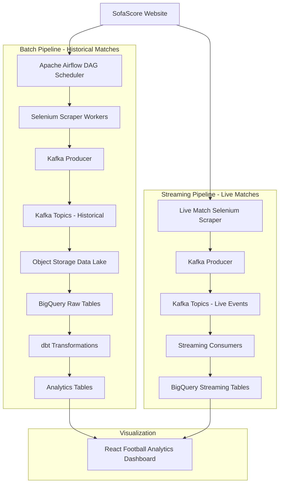

```mermaid
flowchart TD

%% ===============================
%% DATA SOURCE
%% ===============================

A[SofaScore Website]

%% ===============================
%% BATCH PIPELINE (HISTORICAL DATA)
%% ===============================

subgraph Batch Pipeline - Historical Matches
B1[Apache Airflow DAG Scheduler]
B2[Selenium Scraper Workers]
B3[Kafka Producer]
B4[Kafka Topics - Historical]
B5[Object Storage Data Lake]
B6[BigQuery Raw Tables]
B7[dbt Transformations]
B8[Analytics Tables]
end

%% ===============================
%% STREAMING PIPELINE (LIVE MATCHES)
%% ===============================

subgraph Streaming Pipeline - Live Matches
S1[Live Match Selenium Scraper]
S2[Kafka Producer]
S3[Kafka Topics - Live Events]
S4[Streaming Consumers]
S5[BigQuery Streaming Tables]
end

%% ===============================
%% FRONTEND ANALYTICS
%% ===============================

subgraph Visualization
V1[React Football Analytics Dashboard]
end

%% ===============================
%% BATCH FLOW
%% ===============================

A --> B1
B1 --> B2
B2 --> B3
B3 --> B4
B4 --> B5
B5 --> B6
B6 --> B7
B7 --> B8
B8 --> V1

%% ===============================
%% STREAM FLOW
%% ===============================

A --> S1
S1 --> S2
S2 --> S3
S3 --> S4
S4 --> S5
S5 --> V1
```
